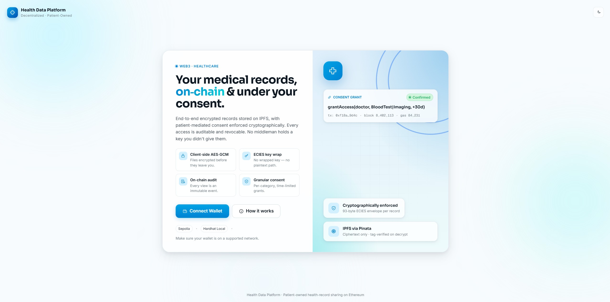

# Health Data Sharing Platform



A decentralized application (dApp) for securely sharing medical records
between patients and healthcare providers on Ethereum. Patients own their
records; access is patient-mediated, cryptographically enforced, and
auditable on-chain. Records are encrypted in the browser before they ever
leave the device — neither IPFS nor the blockchain ever sees plaintext.

## How It Works

The platform separates **data** (encrypted blobs on IPFS) from
**permissions** (consent state on-chain) from **identity** (registry of
patients and doctors). The flow for sharing a record is:

1. **Encrypt client-side.** When a patient uploads a record, the browser
   generates a fresh **AES-256-GCM** key and encrypts the file locally
   using WebCrypto. The plaintext never leaves the device.
2. **Pin ciphertext to IPFS.** Only the encrypted payload is uploaded
   (via Pinata). The returned CID is a public pointer to opaque bytes —
   useless to anyone without the symmetric key.
3. **Wrap the key per-recipient.** The AES key is wrapped with **ECIES
   over secp256k1** (ephemeral keypair + ECDH + HKDF + inner AES-GCM,
   93-byte envelope) for each authorised doctor's published encryption
   public key. Each wrap can only be opened by the corresponding doctor's
   keypair, derived deterministically from a signed canonical message —
   MetaMask never exposes a private key.
4. **Index on-chain.** The IPFS CID, record category, and the patient's
   own wrapped key are written to `HealthRecordStorage`. The transaction
   emits a `RecordStored` event — an immutable, timestamped audit entry.
5. **Granular consent.** When the patient grants a doctor access via
   `ConsentManager.grantAccess`, they specify per-category permissions
   and an optional expiry. The doctor-side wrapped keys (one per
   record-in-category) are bundled into the consent. Doctors can decrypt
   only the categories they were granted, only until the consent
   expires, only while the consent is active.
6. **Revocation and audit.** Patients can revoke at any time
   (`revokeAccess`); every doctor read fires a `RecordAccessed` event.
   Emergency (break-glass) access is supported, but it does **not** hand
   the doctor a decryption key — it logs an
   `EmergencyAccessInvoked` + `EmergencyRecordAccessed` pair on-chain so
   the patient and admins see exactly when, by whom, and why a record
   was read out-of-consent. Privacy is not absolute, but every override
   is observable, attributable, and reviewable after the fact.

All cryptography lives in `frontend/src/utils/crypto.js` and is exercised
by an in-repo self-test (`crypto.test.js`).

## Tech Stack

| Layer             | Technology                                                                                                            |
| ----------------- | --------------------------------------------------------------------------------------------------------------------- |
| Smart contracts   | Solidity `^0.8.20`, OpenZeppelin `^5.0.2` (`Ownable`, `AccessControl`, `ReentrancyGuard`)                             |
| Dev framework     | Hardhat `^2.22` + `@nomicfoundation/hardhat-toolbox` `^5`                                                             |
| Frontend          | React `^18.3` + Vite `^5.2`                                                                                           |
| Styling           | Custom design-system CSS + Tailwind CSS `^3.4` (transitional)                                                         |
| Web3 library      | ethers.js `5.7.2`                                                                                                     |
| Cryptography      | WebCrypto AES-GCM + `@noble/curves` (secp256k1), `@noble/hashes` (HKDF, SHA-256), `@noble/ciphers` (AES) — all `^2.2` |
| Off-chain storage | IPFS via Pinata                                                                                                       |
| Networks          | Hardhat (local) · Ethereum Sepolia testnet                                                                            |

## Architecture

### Contracts

| Contract              | Layer       | Purpose                                                                                                                                                     |
| --------------------- | ----------- | ----------------------------------------------------------------------------------------------------------------------------------------------------------- |
| `PatientRegistry`     | Identity    | Self-registers patients; admin-registers doctors with license hash + hospital; doctors publish a one-time encryption pubkey here.                           |
| `ConsentManager`      | Permissions | Doctor requests access → patient grants/revokes, scoped per category, bounded by expiry; supports emergency (break-glass) invocations, all logged on-chain. |
| `HealthRecordStorage` | Data index  | Patients store records (IPFS CID + category + self-wrapped key); doctors read via `getRecordForDoctor`, emitting a `RecordAccessed` event.                  |

### Roles

| Role    | Can                                                                                                                                                |
| ------- | -------------------------------------------------------------------------------------------------------------------------------------------------- |
| Patient | Self-register, upload encrypted records, grant/revoke doctor access per category with optional expiry, view their own audit history.               |
| Doctor  | Publish a one-time encryption pubkey, request access from a patient, view granted records (logs each read), invoke emergency access (also logged). |
| Admin   | (Deployer / contract owner) register and revoke doctors with on-chain reason, view platform-wide stats and emergency-access audit feed.            |

## Project Structure

```
health-data-platform/
├── contracts/                       # Solidity smart contracts
│   ├── PatientRegistry.sol
│   ├── ConsentManager.sol
│   └── HealthRecordStorage.sol
├── scripts/
│   ├── deploy.js                    # Deploys all three contracts + writes
│   │                                #   frontend/src/config/contract.js
│   └── verifyNetwork.js             # Pre-flight network/signer sanity check
├── test/                            # Hardhat test suites (~105 tests)
│   ├── PatientRegistry.test.js
│   ├── ConsentManager.test.js
│   └── HealthRecordStorage.test.js
├── frontend/
│   ├── src/
│   │   ├── components/
│   │   │   ├── shell/               # Sidebar, Topbar
│   │   │   ├── ui/                  # Card, Button, Modal, Stat, …
│   │   │   ├── AdminPanel.jsx
│   │   │   ├── PatientDashboard.jsx
│   │   │   ├── DoctorDashboard.jsx
│   │   │   └── ConnectWallet.jsx
│   │   ├── config/contract.js       # AUTO-GENERATED — addresses + ABIs
│   │   ├── contexts/                # Theme provider
│   │   ├── styles/design-system.css
│   │   ├── utils/
│   │   │   ├── crypto.js            # AES-GCM + ECIES (secp256k1 / HKDF)
│   │   │   ├── crypto.test.js       # in-repo self-test
│   │   │   ├── ipfs.js              # Pinata upload + multi-gateway fetch
│   │   │   └── events.js            # chunked queryFilter helpers
│   │   ├── App.jsx
│   │   └── main.jsx
│   ├── vite.config.js
│   ├── package.json
│   └── .env.example
├── hardhat.config.js
├── package.json
├── .env.example
└── README.md
```

## Getting Started

### Prerequisites

- Node.js `>= 18` and npm
- A browser with the MetaMask extension installed
- (Optional, for Sepolia) an Alchemy or Infura RPC URL and a funded
  Sepolia wallet — get test ETH from [sepoliafaucet.com](https://sepoliafaucet.com/)

### 1. Install dependencies

```bash
# At the repo root (Hardhat + contracts)
npm install

# Frontend
cd frontend
npm install
cd ..
```

### 2. Configure environment

```bash
# Hardhat side
cp .env.example .env

# Frontend side
cp frontend/.env.example frontend/.env
```

Edit each file and fill in the placeholders. Required for local
development: just the Pinata keys in `frontend/.env`. Required for
Sepolia deployment: also `ALCHEMY_SEPOLIA_URL` and `PRIVATE_KEY` in
`.env`. See `.env.example` and `frontend/.env.example` for the full list.

### 3. Compile contracts

```bash
npm run compile
```

### 4. Run the contract test suite

```bash
npm test
```

The suite covers the three contracts end-to-end across roughly a hundred
test cases (patient/doctor registration paths, consent grant/revoke,
emergency access flow, event emissions, access-control reverts, etc.).

### 5. Deploy

**Local Hardhat (recommended for first run):**

```bash
# Terminal 1
npm run node

# Terminal 2 — deploys + writes frontend/src/config/contract.js
npm run deploy:local
```

**Sepolia testnet:**

```bash
npm run deploy:sepolia
```

The deploy script auto-writes the deployed addresses and ABIs into
`frontend/src/config/contract.js` — no manual copy needed.

### 6. Run the frontend

```bash
cd frontend
npm run dev
```

Vite will open `http://localhost:5173/` automatically. Connect MetaMask
and switch to the network you deployed to (Hardhat Local on chain
`31337`, or Sepolia on chain `11155111`).

## Deployment

**Live demo:** https://health-data-platform.vercel.app/
_(requires MetaMask on Ethereum Sepolia · chain ID `11155111`)_

**Verified contracts on Sepolia Etherscan:**

| Contract              | Address                                      | Etherscan                                                                                      |
| --------------------- | -------------------------------------------- | ---------------------------------------------------------------------------------------------- |
| `PatientRegistry`     | `0x621A0Af4bE4AE611C200b80F1c0421177252dB5b` | [View ↗](https://sepolia.etherscan.io/address/0x621A0Af4bE4AE611C200b80F1c0421177252dB5b#code) |
| `ConsentManager`      | `0xA1C6e25FbDc5C077b3E939c852c1B5cC6937074d` | [View ↗](https://sepolia.etherscan.io/address/0xA1C6e25FbDc5C077b3E939c852c1B5cC6937074d#code) |
| `HealthRecordStorage` | `0x42133E7d793b7eC76BC377D1e2c4dB38D80df97e` | [View ↗](https://sepolia.etherscan.io/address/0x42133E7d793b7eC76BC377D1e2c4dB38D80df97e#code) |

Deploy block: `10951972`. All three contracts have public, verified source on
Etherscan — click any "View ↗" link to compare the verified source against
[`contracts/`](contracts) in this repo.

## Roadmap

**Completed**

- Three contracts deployed and verified on the Ethereum Sepolia testnet
- End-to-end encrypted record sharing with a SHA-256-verified decrypt loop
- Patient-mediated granular consent with per-category ECIES key wrapping
- On-chain audit trail for all normal and emergency-access events
- Full admin console with doctor lifecycle management

**Future improvements**

- Mainnet deployment (requires a professional security audit, HIPAA/GDPR
  compliance review, and key-management hardening — out of scope for this
  coursework version)
- Doctor encryption-key rotation (currently non-rotatable by contract
  design to prevent silent key swaps)
- Server-side Pinata proxy to prevent API-key exposure in the browser
  bundle (correct production architecture)
- FHIR integration for standards-based clinical-data interoperability
- Zero-knowledge proofs for category-level access without revealing the
  record-list metadata

## Security Notes

- **Encrypted before upload.** AES-GCM encryption happens entirely
  client-side, before any byte leaves the browser. IPFS and the
  blockchain only ever see ciphertext + opaque wrapped keys.
- **Patient-mediated access.** A doctor cannot read a record without a
  consent the patient has actively granted; consent revocation takes
  effect immediately on-chain.
- **Auditable break-glass.** Emergency access cannot silently read
  records — it emits on-chain events that surface in the patient's
  history and the admin's audit feed.
- **No real secrets in git.** Both `.env` and `frontend/.env` are
  git-ignored; commit only the `.env.example` templates. Never commit a
  funded private key, an API key, or a JWT.
- **No production audit.** See the note below — this code has not been
  professionally audited.

## Academic Project

This project is a university coursework deliverable (Blockchain module,
CCS6354) and is intended for educational and demonstration purposes
only. The contracts have not been professionally audited, the
threat-model has not been formally validated, and the platform is **not
intended for use with real patient medical data**. Use Sepolia or a
local Hardhat node — never deploy this to Ethereum mainnet.

## License

[MIT](LICENSE)
